# S1 — EC2 provider lifecycle and routing

S1 makes EC2 a selectable Oddish/Harbor backend without making it the default.
It covers provider registration, fixed launch configuration, SSH-key handling,
Harbor lifecycle identity, and ownership-checked teardown. Hosted packaging,
normal/override-engine config parity, contextual trial/job tags, and orphan
reconciliation belong to S2/S3.

## Runtime flow

1. `Settings` reads the opt-in EC2 configuration. When
   `ODDISH_EC2_ENABLED=true`, region, AMI, subnet, key name, security groups,
   SSH user, public-IP mode, and a positive root volume are required. The SSH
   private key is deliberately worker-only and is checked when a worker needs
   it, not when an API/reconciler process starts.
2. `runtime.registry` inserts one `Ec2Backend` singleton after Daytona and
   before Modal. Therefore an explicit `environment=ec2` can resolve, while
   ordinary CPU work still chooses Daytona and GPU work still chooses Modal.
3. Submission and worker validation reject `delete=false`, GPU/TPU requests,
   attach mode, metadata overrides, SSH-control overrides,
   and every other platform-owned EC2 launch option. User tags are allowed only
   when they do not replace Oddish or Harbor ownership tags.
4. For a normal in-process Harbor run, `Ec2Backend.harbor_env_kwargs()` resolves
   the current AWS account with STS, writes the SSH secret to a temporary `0600`
   file, and combines fixed platform values with protected management,
   deployment, and account tags. The runner removes the temporary file in an
   outer `finally`, including errors and cancellation.
5. The compatibility patch gives Harbor's `EC2Environment` the provider name
   `ec2`. For Oddish-managed instances, `get_sandbox_id()` returns
   `ec2://<account>/<region>/<instance-id>`; direct non-Oddish Harbor use keeps
   the raw instance ID. The patch disables IMDS when no instance profile is
   configured and requires IMDSv2 tokens for a platform-owned profile. Harbor applies its merged
   tags to both the instance and root volume.
6. Harbor emits the provider and external handle through its lifecycle hooks.
   Existing Oddish worker code can persist those fields on `worker_jobs`, so
   cancellation and stale-worker cleanup can call the registered backend.
7. `Ec2Backend.teardown()` parses the self-describing handle, asks STS for the
   account used by the *current* credentials, describes the instance in the
   handle's region, and verifies managed, deployment, and account tags before
   calling `TerminateInstances`. Malformed handles, account mismatches, missing
   instances, wrong tags, and AWS errors are logged and return `False`.

```mermaid
flowchart LR
  Submit["explicit environment=ec2"] --> Validate["schema + worker validation"]
  Validate --> Backend["Ec2Backend fixed kwargs + 0600 SSH key"]
  Backend --> Harbor["Harbor EC2Environment"]
  Harbor --> Launch["RunInstances; instance + volume tags; IMDS off or v2-only"]
  Launch --> Hook["hook: provider=ec2 + account/region/instance handle"]
  Hook --> Persist["worker_jobs provider/external_id"]
  Persist --> Teardown["describe + ownership check + terminate"]
```

## Suspicious-part sweep

- **Cached AWS identity — real bug, fixed.** The registry stores a long-lived
  backend singleton. It previously cached the first STS account ID, so an
  in-process credential rotation could make teardown compare a handle with
  stale identity data. STS is now queried on every launch/teardown identity
  check. A regression test rotates from one account to another and proves EC2
  is never called with the old handle.
- **Tenant-controlled SSH behavior — real bug, fixed.** Several Harbor EC2
  kwargs (`ssh_port`, host-key policy/path, and readiness timeouts) were not in
  the protected set. They are now rejected alongside the other fixed platform
  settings, so a submitted task cannot weaken host-key checking or redirect the
  worker's SSH behavior.
- **Temporary key lifetime — verified safe for the S1 in-process path.** Key
  creation is lazy, mode `0600`, and never logged. Reference-counted leases keep
  shared files alive while concurrent in-process trials still use them and
  remove them after the final return, ordinary exception, or `CancelledError`.
  The override-Harbor child
  does not yet receive resolved EC2 kwargs in S1; that is an explicit S2 slice
  boundary rather than a fallback.
- **Validation before routing — verified safe.** The worker repeats EC2
  validation after the trial environment is resolved and before either Harbor
  engine. Schema validation catches explicit EC2 configs earlier. An append
  whose EC2 environment is learned only from server state can therefore fail at
  the worker instead of at HTTP validation, but it cannot launch with forbidden
  settings; resolving that earlier is part of hosted validation work in S2.
- **Patch ordering — verified safe for the pinned Harbor.** The pinned module
  exposes `EC2Environment` and `_run_instances_kwargs`; enabling EC2 fails
  loudly if either surface disappears. The patch uses a `WeakSet` keyed by the
  real class, so a class attribute cannot spoof the idempotence guard.
- **Config or region drift during cleanup — verified safe.** Teardown uses the
  account and region captured in the external handle, then checks current STS
  identity and ownership tags. It does not trust today's configured region or
  a bare instance ID.

## Focused verification

`oddish/tests/test_runtime_ec2_backend.py`: **92 passed**. This covers opt-in
registration and unchanged routing, settings and protected inputs, key
permissions/cleanup, lifecycle patch behavior, account-and-region handles,
ownership-checked termination, AWS failures, and credential rotation.
