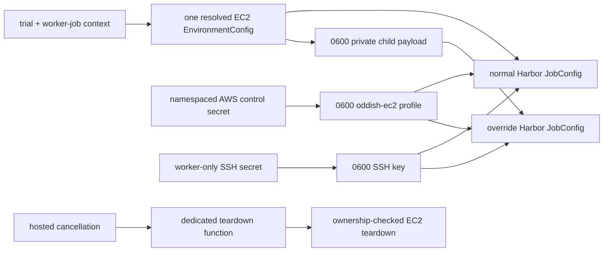

# S2 — EC2 execution parity and hosted deployment

S2 carries the fixed EC2 provider configuration through both Harbor execution
engines, installs the required worker dependencies, and keeps the hosted secret
topology narrow. It does not scan AWS for unlinked instances; that is S3.

## Execution flow

1. The trial runner validates the submitted EC2 configuration and resolves one
   complete Harbor `EnvironmentConfig` before choosing an execution engine.
   `Ec2Backend` supplies the platform-owned launch values and protected
   management/deployment/account tags; the runner adds the Oddish trial and
   worker-job IDs.
2. A normal pin gives that resolved object directly to `JobConfig`. An
   allowlisted override serializes the same object to a private mode-`0600`
   payload outside the artifact tree. The child reads and unlinks the payload
   immediately, then constructs its `JobConfig` without provider-specific
   merging.
3. The worker writes the EC2 SSH key and namespaced AWS credentials to separate
   mode-`0600` temporary files. Harbor receives a fixed `oddish-ec2` profile and
   SSH-key path. Raw `ODDISH_EC2_*` secrets are removed from the override
   child's environment; the parent removes both files after the trial.
4. The default and blessed-variant trial functions receive the normal runtime
   secrets, the EC2 control secret, and the worker-only SSH secret. The
   reconciler and dedicated teardown function receive runtime plus control;
   the API, dispatcher, and unrelated functions receive neither EC2 secret.
5. Hosted API cancellation uses the neutral provider-teardown delegate in
   `oddish.core.helpers`. The delegate performs one remote call to the dedicated
   control-secret-bearing Modal function, which runs the same ownership-checked
   `Ec2Backend.teardown()` as stale cleanup. Standalone Oddish uses that backend
   directly with its local credentials.
6. EC2's enable flag and public launch settings are baked from an explicit
   non-secret allowlist. Modal also bakes the two secret dependency names and
   fails startup if runtime enablement disagrees with that plan. Raw EC2 secret
   values in `backend/.env` are rejected because that file feeds the broad
   runtime secret.
7. Worker images install OpenSSH. The Python worker extra pins the boto3 version
   compatible with the existing aioboto3 storage stack; the isolated override
   environment installs the selected Harbor pin with its `ec2` extra.

## Adversarial review results

- **Runtime/baked secret-plan divergence — real bug, fixed.** A stale broad
  Modal secret could previously enable EC2 after an image had baked zero EC2
  dependencies, or disable it after dependencies were baked. Local deploy and
  container startup now compare runtime enablement with the immutable plan and
  fail loudly on disagreement.
- **Global EC2 patch failure — real bug, fixed.** An EC2-enabled deployment
  previously required every alternate Harbor pin to expose EC2 internals even
  for Daytona, Modal, or GKE trials. Patch compatibility is now fatal only when
  the current trial selects EC2; a later EC2 trial still performs the check.
- **Crash-time payload artifact leak — real bug, fixed.** The override payload
  contains job-scoped environment values. It used to live under the wrapper job
  directory and could be uploaded when a child failed before producing an
  outcome. It now lives outside the artifact tree, is mode `0600`, and is
  removed by both child and parent cleanup paths.
- **Duplicate terminate audit call — real bug, fixed.** A graceful Harbor
  finalizer can begin instance termination before post-cancel backend teardown.
  The backend now treats an owned `shutting-down` or `terminated` instance as a
  successful no-op instead of issuing another `TerminateInstances` call.
- **EC2 credentials in an override child — accepted trust boundary.** A Harbor
  implementation must use the AWS profile to launch and the SSH key to operate
  the VM. Override Harbor sources are therefore trusted executable code gated
  by the operator's source allowlist, just as they already are for model
  credentials. Moving these operations behind a broker would be a different
  architecture and would contradict the requested direct Harbor EC2 path.
- **Pre-hook instance identity — covered by S3, not deferred silently.** Harbor
  cannot report an instance ID before `RunInstances`, and a worker can die
  during health/SSH/bootstrap waits. Protected trial/job tags are attached
  atomically at launch so S3 can discover and judge that unlinked instance
  without a database handle.

## Focused verification

The combined S1/S2 runtime, Harbor patch, routing, environment, override-child,
CLI, packaging, hosted-policy, secret-topology, cancellation, retry, and BYOK
suites pass: **270 passed, 3 skipped**. Both project lockfiles also pass
`uv lock --check --offline`.
